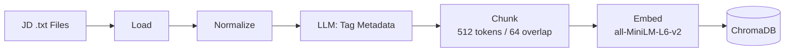
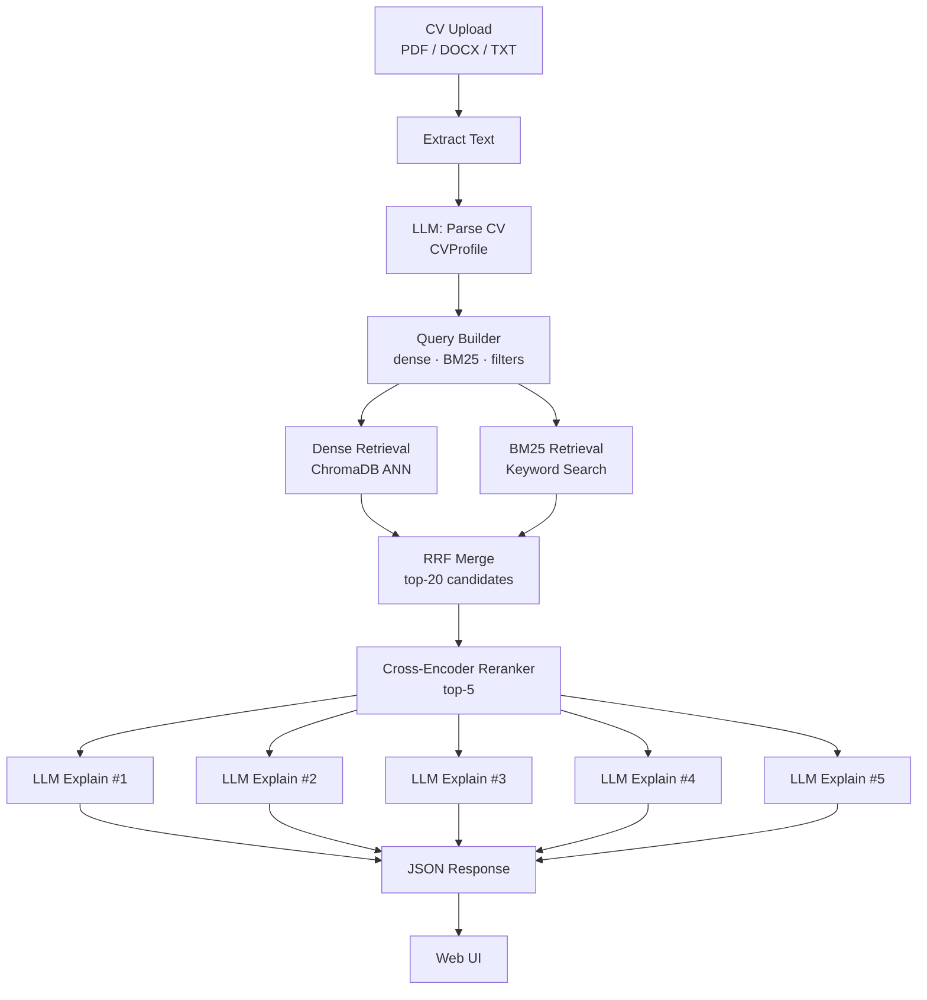

# CV–JD Matcher: Technical Overview

## 1. Introduction

The CV–JD Matcher is a Retrieval-Augmented Generation (RAG) system that automatically ranks a pool of job descriptions against an uploaded candidate CV. A user uploads their CV (PDF, DOCX, or TXT), and the system returns the top 5 most relevant jobs along with a structured, human-readable explanation of why each job is a good match — including specific skill alignments, potential gaps, and a seniority fit assessment.

The system combines four techniques to achieve accurate, explainable matching:

1. **Hybrid retrieval** — dense semantic search (vector embeddings) combined with BM25 keyword search, merged via Reciprocal Rank Fusion
2. **Cross-encoder reranking** — a fine-tuned model that reads the CV and JD together for precise joint scoring
3. **LLM-structured parsing** — both CVs and JDs are parsed into strict Pydantic schemas via LLM calls, removing reliance on brittle regex heuristics
4. **Parallel LLM explanations** — five concurrent LLM calls generate structured match explanations in ~3–5 seconds

**Tech stack:** Python 3.11+, FastAPI, LangChain, ChromaDB, HuggingFace sentence-transformers, OpenAI / Anthropic LLMs, vanilla JS single-page UI.

---

## 2. Architecture Overview

The system has two distinct pipelines: an **offline** ingestion pipeline that runs once at setup (or whenever JDs are added), and an **online** matching pipeline that runs on every CV upload.

### Offline Pipeline — JD Ingestion



### Online Pipeline — CV Matching



---

## 3. Project Structure

```
RAG_JD_matcher/
├── main.py                          # Server entry point (uvicorn on port 9000)
├── requirements.txt                 # Python dependencies
├── .env                             # Configuration (model names, paths)
├── .gitignore
│
├── app/
│   ├── __init__.py
│   ├── models.py                    # All Pydantic data models
│   ├── config.py                    # Settings loader (pydantic-settings, reads .env)
│   ├── llm.py                       # LLM factory (OpenAI or Anthropic)
│   ├── cv_parser.py                 # CV text extraction + LLM parsing → CVProfile
│   ├── query_builder.py             # CVProfile → retrieval queries (dense, BM25, filters)
│   ├── retriever.py                 # Hybrid retrieval: dense + BM25 + RRF merge
│   ├── reranker.py                  # Cross-encoder reranking (top-20 → top-5)
│   ├── explainer.py                 # Parallel LLM explanation generation
│   ├── jd_ingestion.py              # Offline JD ingestion pipeline (CLI entry point)
│   └── api/
│       ├── __init__.py
│       ├── routes.py                # FastAPI app: /match, /parse-cv, /health endpoints
│       └── static/
│           └── index.html           # Single-page web UI
│
├── test_jds/                        # 30 sample job descriptions (JD01–JD30, plain .txt)
├── chroma_db/                       # Persisted ChromaDB vector store (generated)
└── docs/
    └── technical_overview.md        # This document
```

---

## 4. Configuration

All configuration is stored in `.env` and loaded at startup via `pydantic-settings`. **API keys are not stored in `.env`** — they are supplied at runtime by the user through the web UI.

| Variable | Example | Purpose |
|---|---|---|
| `OPENAI_MODEL` | `gpt-4.1` | Model name for OpenAI LLM calls |
| `ANTHROPIC_MODEL` | `claude-sonnet-4-6` | Model name for Anthropic LLM calls |
| `EMBEDDING_MODEL` | `all-MiniLM-L6-v2` | HuggingFace model for local embeddings |
| `CHROMA_PERSIST_DIR` | `./chroma_db` | Directory where ChromaDB is persisted |
| `JD_COLLECTION_NAME` | `job_descriptions` | ChromaDB collection name |
| `JD_SOURCE_DIR` | `./test_jds` | Default source directory for JD ingestion |

The settings class (`app/config.py`) uses `SettingsConfigDict(env_file=".env", extra="ignore")` — any extra variables in `.env` are silently ignored.

---

## 5. Data Models (`app/models.py`)

All data flowing through the pipeline is typed with Pydantic v2 models. This enforces schema compliance at every boundary, including LLM outputs via `llm.with_structured_output()`.

### JD Models (offline pipeline)

```python
class JDMetadata(BaseModel):
    title: str                                        # Job title extracted by LLM
    company: str                                      # Company name ("[Company]" if anonymous)
    seniority: Literal["junior", "mid", "senior", "lead"]
    required_skills: list[str]                        # Soft + hard skills (excluding tech_stack)
    tech_stack: list[str]                             # Hard technical tools and languages only

class JDChunk(BaseModel):
    jd_id: str                                        # e.g. "JD03"
    chunk_id: str                                     # e.g. "JD03_chunk_0_a1b2c3d4"
    chunk_type: Literal["summary", "responsibilities", "requirements", "benefits"]
    text: str                                         # Chunk content
    metadata: dict                                    # Flat dict for ChromaDB storage

class JDCandidate(BaseModel):
    jd_id: str
    title: str
    company: str
    full_text: str                                    # Reconstructed full JD (all chunks joined)
    retrieval_score: float                            # RRF score from hybrid retrieval
    rerank_score: float | None = None                 # Softmax score assigned by cross-encoder
```

### CV Models (online pipeline)

```python
class WorkExperience(BaseModel):
    title: str
    company: str
    years: float                                      # Duration in years (float for part-years)
    description: str

class Education(BaseModel):
    degree: str
    institution: str
    year: int | None = None

class CVProfile(BaseModel):
    name: str
    total_years_experience: float                     # Sum across all roles
    seniority: Literal["junior", "mid", "senior", "lead"]
    skills: list[str]                                 # All competencies excluding tech_stack
    tech_stack: list[str]                             # Hard technical tools only
    roles: list[WorkExperience]
    education: list[Education]
    domains: list[str]                                # Industry domains (e.g. "fintech")
    raw_text: str                                     # Full CV text verbatim (for reranker)
```

### Query and Result Models

```python
class RetrievalQuery(BaseModel):
    dense_query: str    # Natural language string for embedding
    bm25_query: str     # Flat keyword string for BM25
    filters: dict       # ChromaDB metadata pre-filter

class MatchExplanation(BaseModel):
    summary: str                        # 4–5 sentence paragraph
    matching_signals: list[str]         # Specific CV–JD overlaps
    potential_gaps: list[str]           # Unmet JD requirements (empty list if none)
    seniority_fit: Literal["under", "match", "over"]

class MatchResult(BaseModel):
    rank: int
    jd_id: str
    title: str
    company: str
    rerank_score: float                 # Softmax score (top-5 sum to 1.0)
    explanation: MatchExplanation
```

---

## 6. Offline Pipeline: JD Ingestion (`app/jd_ingestion.py`)

Run once before the application is used, and again whenever new JDs are added to the source directory.

### CLI

```bash
python -m app.jd_ingestion --api-key sk-... --provider openai
python -m app.jd_ingestion --api-key sk-ant-... --provider anthropic --source ./my_jds --no-reset
```

| Flag | Default | Description |
|---|---|---|
| `--api-key` | *(required)* | LLM API key for metadata tagging |
| `--provider` | `openai` | `openai` or `anthropic` |
| `--source` | `JD_SOURCE_DIR` from `.env` | Path to directory of `.txt` JD files |
| `--no-reset` | *(flag, off by default)* | Append to existing collection instead of wiping it |

### Pipeline Steps

**Step 1 — Load** (`load_jd_files`)

Reads all `.txt` files from the source directory. The `jd_id` is derived from the filename stem prefix before the first underscore (e.g. `JD03_devops_engineer.txt` → `JD03`). Returns a list of `(jd_id, raw_text)` tuples.

**Step 2 — Normalize** (`parse_jd`)

Collapses excessive newlines (`\n{3,}` → `\n\n`) and normalises line endings. No semantic transformation is applied — plain-text JDs are left as-is.

**Step 3 — Tag Metadata** (`tag_metadata`)

Calls the LLM with a structured prompt to extract `JDMetadata` from the raw JD text. The prompt instructs the LLM to:

- Classify seniority level: junior (0–2 yr), mid (2–5 yr), senior (5–10 yr), lead (10+ yr or people-management)
- Extract `tech_stack`: hard technical tools, languages, and frameworks only
- Extract `required_skills`: all other competencies (soft and hard, excluding `tech_stack` duplicates)
- Use `[Company]` if the company name is not explicitly stated

Uses `llm.with_structured_output(JDMetadata)` to enforce the schema.

**Step 4 — Chunk** (`chunk_jd`)

Splits each JD into fixed-size chunks using `RecursiveCharacterTextSplitter(chunk_size=512, chunk_overlap=64)`. Each chunk is wrapped in a `JDChunk` with a flat metadata dict containing:

- `jd_id`, `title`, `company`, `seniority`
- `required_skills`, `tech_stack` — serialised as comma-separated strings (ChromaDB requires scalar metadata values)
- `date_added`, `chunk_type`

**Step 5 — Embed & Index** (`embed_and_index`)

Embeds all chunks using `HuggingFaceEmbeddings(model_name="all-MiniLM-L6-v2")` — a local model requiring no API key. Upserts all documents into the ChromaDB collection. If `reset=True` (the default), the existing collection is deleted and recreated before indexing.

---

## 7. Online Pipeline: CV Matching

Triggered by every `POST /match` request.

### 7.1 CV Extraction & Parsing (`app/cv_parser.py`)

**`extract_text(file_bytes, filename) → str`**

Detects the file format from the extension and extracts plain text:

| Format | Library | Method |
|---|---|---|
| `.pdf` | PyMuPDF (`fitz`) | Iterates pages, calls `page.get_text()` |
| `.docx` | `python-docx` | Iterates paragraphs, joins text |
| `.txt` | Built-in | UTF-8 decode with error replacement |

Raises `ValueError` for unsupported extensions.

**`parse_cv(raw_text, llm) → CVProfile`**

Calls the LLM with the raw CV text and today's date. The structured prompt instructs the LLM to:

- Sum `total_years_experience` across all roles; for roles with no end date (current/present), use today's date to calculate duration
- Classify seniority: junior (0–2 yr), mid (2–5 yr), senior (5–10 yr), lead (10+ yr or management title)
- Separate `tech_stack` (hard tools only) from `skills` (all other competencies)
- Populate `domains` with industry sectors identified from work history (e.g. "fintech", "healthcare")
- Copy the full CV text verbatim into `raw_text`

Uses `llm.with_structured_output(CVProfile)`.

---

### 7.2 Query Building (`app/query_builder.py`)

Converts a `CVProfile` into three retrieval representations via `build(profile) → RetrievalQuery`.

**Dense query** — natural language string for semantic embedding:
```
"4.0 years experience, Backend Engineer, mid, Python, FastAPI, PostgreSQL, Docker, fintech"
```
Built from: `total_years_experience`, `roles[0].title`, `seniority`, top 8 `tech_stack` items, all `domains`.

**BM25 query** — flat keyword string for TF-IDF matching:
```
"Python FastAPI PostgreSQL Docker problem solving backend engineer"
```
Built from: all `tech_stack`, top 6 `skills`, `roles[0].title`.

**Metadata filter** — ChromaDB pre-filter to restrict the candidate pool by seniority:
```python
{"seniority": {"$in": ["junior", "mid", "senior"]}}  # for a "mid" candidate
```
The candidate's seniority level is expanded ±1 level in each direction (`junior→[junior,mid]`, `mid→[junior,mid,senior]`, `senior→[mid,senior,lead]`, `lead→[senior,lead]`). This captures adjacent roles without broadening the search too much.

**Rerank text** — compact structured summary for the cross-encoder (~100 tokens):
```
Senior Backend Engineer | 7.0 years | fintech
Tech: Python, FastAPI, PostgreSQL, Docker, Redis, Kubernetes
Skills: system design, agile, team leadership
Recent: Lead Engineer at Acme Corp (3 yr) — Built microservices platform handling...
```
Kept short because the cross-encoder reads this text together with the full JD text within a 512-token budget.

---

### 7.3 Hybrid Retrieval (`app/retriever.py`)

**`retrieve(query, k=20) → (dense_hits, bm25_hits, merged)`**

**Dense Retrieval**

Calls `Chroma.similarity_search_with_relevance_scores(dense_query, k=fetch_k, filter=filters)`. ChromaDB embeds the query string using the same `all-MiniLM-L6-v2` model, performs ANN search, and applies the metadata filter as a pre-filter. Returns up to 40 results (2× over-fetch to account for deduplication).

Results are deduplicated by `jd_id` — when multiple chunks from the same JD rank highly, only the highest-scoring chunk is kept. This produces a ranked list of unique JDs by cosine similarity.

**BM25 Retrieval**

Fetches all chunks matching the metadata filter from ChromaDB (no embedding required — this is a pure metadata scan). The chunks are then grouped by `jd_id` and their texts concatenated to reconstruct the full JD text (`_reconstruct_jds`). A `BM25Retriever` is built over this corpus and invoked with the `bm25_query` keyword string.

Results are also deduplicated by `jd_id`.

**Reciprocal Rank Fusion (RRF) Merge**

The two ranked lists are merged using RRF with a 60/40 weighting:

```
score(jd_id) = 0.6 × (1 / (dense_rank + 60)) + 0.4 × (1 / (bm25_rank + 60))
```

The constant 60 dampens the impact of rank differences at the top of each list. If a JD appears in only one retriever, it receives a penalty rank equal to `len(all_unique_ids) + 60`, so it still contributes a small score rather than being excluded.

The final merged list is sorted by RRF score and the top-20 are returned as `list[JDCandidate]`.

> **Why two retrievers?** Dense search captures semantic similarity (e.g. "distributed systems" matching "cloud infrastructure"), while BM25 catches exact keyword matches (e.g. a specific framework name). RRF combines both signals without requiring score normalisation.

---

### 7.4 Cross-Encoder Reranking (`app/reranker.py`)

**`rerank(cv_text, candidates, top_k=5) → list[JDCandidate]`**

**Model:** `cross-encoder/ms-marco-MiniLM-L-6-v2` (loaded once at module import).

Unlike the bi-encoder used for embedding (which encodes query and document independently), a cross-encoder reads both texts jointly:

```
[CLS] cv_text [SEP] jd_full_text [SEP]
```

This allows the model to detect fine-grained mismatches — e.g., "5 years required" vs "2 years experience" — that vector similarity cannot capture. The trade-off is that it is slower, so it is only applied to the top-20 candidates from hybrid retrieval.

**Process:**

1. Build pairs: `[(cv_text, candidate.full_text) for candidate in candidates]`
2. Call `model.predict(pairs)` → raw logits (unbounded, can be negative)
3. Sort by logit descending, take top-5
4. Apply softmax over the top-5 logits so scores sum to 1.0:
   ```
   rerank_score_i = exp(logit_i) / sum(exp(logit_j) for j in top-5)
   ```
5. Attach the normalised `rerank_score` to each candidate

The `cv_text` passed to the reranker is `build_rerank_text(profile)` — a compact structured summary (see §7.2) rather than the raw CV, because the cross-encoder model was trained on short query-passage pairs and silently truncates inputs to 512 tokens.

---

### 7.5 LLM Explanation (`app/explainer.py`)

**`explain_all(cv_profile, jds, llm) → list[MatchResult]`**

Generates a structured `MatchExplanation` for each of the top-5 reranked JDs. All 5 LLM calls run concurrently via `asyncio.gather`, reducing latency from ~15s (serial) to ~3–5s.

**Per-call process** (`explain`):

1. Serialise `CVProfile` to JSON (excluding `raw_text` to save tokens)
2. Call LLM with the profile JSON and the full JD text
3. LLM returns a `MatchExplanation` object via `llm.with_structured_output(MatchExplanation)`

**Rank-aware tone:**

| Rank | Tone |
|---|---|
| 1 | highly relevant |
| 2 | relevant |
| 3 | moderately relevant |
| 4–5 | somewhat relevant |

The summary always opens with: *"This job is {tone} for the candidate because..."*

**Output fields:**

| Field | Description |
|---|---|
| `summary` | 4–5 sentence paragraph covering skill alignment, domain fit, experience level, and gaps |
| `matching_signals` | Specific overlaps — references actual skill names, years, domain terms (e.g. "5 years Python matches 4-year requirement") |
| `potential_gaps` | Concrete unmet JD requirements; empty list if none |
| `seniority_fit` | `"under"` (candidate underqualified), `"match"`, or `"over"` (overqualified) |

---

## 8. LLM Factory (`app/llm.py`)

**`build_llm(api_key, provider="openai") → ChatOpenAI | ChatAnthropic`**

A thin factory function called once per request in the route handler. The API key is always caller-supplied — it is never read from environment variables. This ensures the application does not work at all without a valid key entered by the user.

| Provider | LangChain class | Settings |
|---|---|---|
| `openai` | `ChatOpenAI` | `temperature=0`, `seed=42`, `top_p=1` |
| `anthropic` | `ChatAnthropic` | `temperature=0`, `top_k=1`, `top_p=1` |

`top_k=1` forces greedy decoding on Anthropic (only the single most probable token is considered at each step). `top_p=1` disables nucleus sampling truncation on both providers, letting `temperature` and `top_k` handle determinism. `seed=42` seeds the RNG on OpenAI's side for reproducible outputs.

The model name (e.g. `gpt-4.1`) is read from `.env` via `settings.openai_model` / `settings.anthropic_model` — model names are configuration, not secrets.

All LLM calls across the codebase use `llm.with_structured_output(PydanticModel)`, which instructs the LLM to return JSON conforming to the model's schema. No free-form text parsing is required anywhere in the pipeline.

---

## 9. API Reference (`app/api/routes.py`)

The FastAPI application is defined in `routes.py` and served by uvicorn from `main.py` on port 9000.

### Endpoints

| Method | Path | Description |
|---|---|---|
| `GET` | `/` | Serves the web UI (`index.html`) |
| `GET` | `/health` | Health check → `{"status": "ok"}` |
| `GET` | `/jds` | Lists all `.txt` filenames in the configured JD source directory → `{"files": [...]}` |
| `GET` | `/jds/download` | Zips the JD source directory and streams it as `job_descriptions.zip` |
| `POST` | `/parse-cv` | Parses CV only, returns `CVProfile` as JSON |
| `POST` | `/match` | Full pipeline — returns profile + top-5 matches with explanations |

### Form Fields (`/match` and `/parse-cv`)

| Field | Type | Description |
|---|---|---|
| `cv_file` | `UploadFile` | CV file (.pdf, .docx, or .txt) |
| `api_key` | `str` | LLM API key (required; 400 if empty) |
| `llm_provider` | `str` | `"openai"` (default) or `"anthropic"` |

### Error Responses

| Status | Condition |
|---|---|
| 400 | Empty or missing `api_key`; unsupported file type |
| 401 | LLM API key rejected by provider (detected via error message heuristics) |
| 422 | CV parsing, retrieval, or explanation failure |

Authentication errors are detected by scanning the exception message for patterns such as `"incorrect api key"`, `"invalid api key"`, `"authentication"`, or `"401"`, and the user receives a clean message: *"Invalid API key. Please check your key and try again."*

### `/match` Response Shape

```json
{
  "profile": { "name": "...", "seniority": "mid", "total_years_experience": 4.0, ... },
  "candidate": { "name": "...", "seniority": "mid", "years_experience": 4.0, "domains": [...] },
  "queries": { "dense": "...", "bm25": "...", "filters": {...} },
  "retrieval": { "dense_hits": [...], "bm25_hits": [...], "merged": [...] },
  "reranked": [
    {
      "rank": 1,
      "jd_id": "JD03",
      "title": "DevOps Engineer",
      "company": "[Company]",
      "rerank_score": 0.38,
      "explanation": {
        "summary": "This job is highly relevant for the candidate because...",
        "matching_signals": ["5 years Python matches 4-year requirement", ...],
        "potential_gaps": ["No Kubernetes experience mentioned", ...],
        "seniority_fit": "match"
      }
    },
    ...
  ]
}
```

---

## 10. Web UI (`app/api/static/index.html`)

A single-page application built with vanilla HTML, CSS, and JavaScript. No build step required.

### Features

- **API key bar** — Provider selector (OpenAI / Anthropic, defaulting to Anthropic) and password-masked API key input at the top of the page. The submit button remains disabled until both a CV file and a non-empty API key are provided.
- **CV upload** — Drag-and-drop zone or click-to-browse for `.pdf`, `.docx`, and `.txt` files.
- **JD info bar** — Sits between the upload zone and the submit button. Shows the text "The jobs will be selected from a predefined list of JDs" alongside two action buttons: **View list of jobs** (opens a modal listing all `.txt` filenames via `GET /jds`) and **Download JDs** (triggers a zip download via `GET /jds/download`).
- **Two-column results layout:**
  - **Left — Candidate Profile:** Overview card (name, seniority, years, domains), skills & tech stack tags, work history table, education table.
  - **Right — Matched Jobs:** Five collapsible cards. The collapsed state shows the rank badge, job title, company, and rerank score as a percentage. Clicking a card expands it to reveal:
    - The 4–5 sentence match summary
    - Matching signals with ✓ indicators
    - Potential gaps with ⚠ indicators
    - A colour-coded seniority fit badge (green = match, yellow = under, blue = over)

### Request Flow

1. User selects file and enters API key → button enables
2. On click: `FormData` is built with `cv_file`, `api_key`, `llm_provider`
3. `fetch('/match', { method: 'POST', body: form })` is called
4. On success: `renderProfile(data.profile)` populates the left column; `renderJDs(data.reranked)` populates the right column; the results grid becomes visible
5. On error: the `detail` field from the API response is shown below the button

---

## 11. Performance

| Stage | Typical latency | Notes |
|---|---|---|
| CV extraction | < 1s | Depends on file size |
| CV parsing | 2–5s | Single LLM call |
| Query building | < 100ms | Pure Python |
| Dense retrieval | 200–500ms | Includes embedding + ANN |
| BM25 retrieval | 100–300ms | In-memory BM25 over filtered corpus |
| RRF merge | < 100ms | Pure Python |
| Cross-encoder reranking | 1–2s | 20 pairs, single batched forward pass |
| LLM explanation (×5) | 3–5s | Parallel via `asyncio.gather` |
| **Total** | **~10–15s** | LLM calls dominate; actual time varies by provider and model |

The explanation step would take ~15s if run serially. Running all 5 calls in parallel via `asyncio.gather` reduces this to the latency of the single slowest call (~3–5s).
